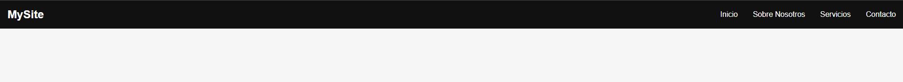
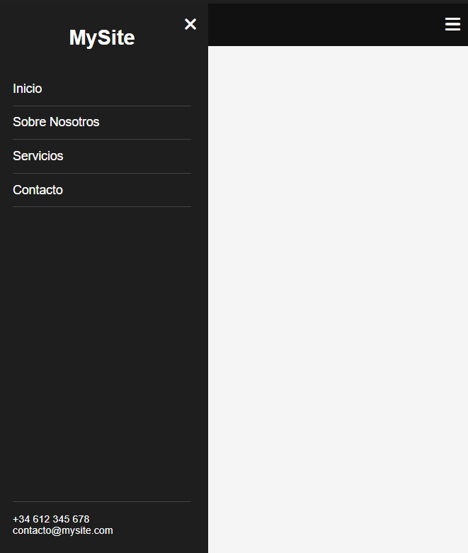

# Responsive Header

A fully responsive navigation header with a hamburger menu for mobile and a horizontal menu for desktop.

## 🔧 Features
- Mobile-friendly hamburger menu
- Desktop horizontal navigation
- Easy to customize
- Includes Font Awesome icons
- Lightweight and clean code

## 💡 How to use
1. Download or clone this repository.
2. Open `index.html` in your browser or integrate the header into your own site.

## 📁 File structure
- `index.html` – contains all HTML, CSS, and JS in one file.

## 📸 Preview

### Desktop

### Mobile (Sidebar)

---

Made by [@yery27](https://github.com/yery27) 🚀
