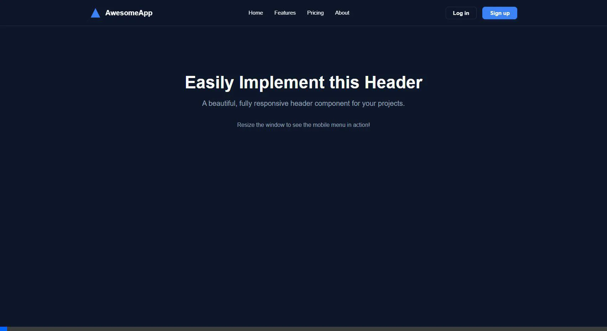

# Universal Responsive Header Component 🚀

A modern, highly responsive, and easy-to-implement header component for any web project. Built with plain HTML, CSS, and Vanilla JavaScript (no framework required). Designed with a modern dark theme and glassmorphism effects.



## Features
- 📱 **Fully Responsive:** Beautiful mobile-first hamburger menu functionality perfectly adapted for all screen sizes.
- 🎨 **Modern Aesthetics:** Features glassmorphism effects (backdrop blur) and sleek UI transitions.
- ✨ **Smooth Animations:** Includes hover animations and dynamic shadowing when scrolling.
- ⚡ **Lightweight:** 0 external dependencies. Just HTML, CSS, and JS.
- 🛠 **Highly Customizable:** Fully uses CSS variables to let you adapt the branding to any site.

## Installation & Usage

It's extremely simple to add this exactly as it is to your project. Follow these 3 easy steps:

### 1. Include the HTML

Open `index.html` and copy the `<header>` block. Paste it inside the `<body>` of your website exactly where you want the header to appear (usually at the very top).

### 2. Include the CSS

Copy `header.css` to your project directory. Link it inside your HTML `<head>` tag:

```html
<link rel="stylesheet" href="path/to/header.css">
```

### 3. Include the JavaScript

Copy `header.js` into your project directory. Link it at the bottom of your HTML `<body>` tag so it controls the mobile menu correctly:

```html
<script src="path/to/header.js"></script>
```

## Customizing The Theme

This component utilizes CSS variables, allowing you to quickly change colors to match your branding.
Open `header.css` and modify the `:root` structure at the top:

```css
:root {
    --header-bg: rgba(15, 23, 42, 0.8);      /* Background color */
    --header-text: #f8fafc;                  /* Text color */
    --header-text-hover: #60a5fa;            /* Text color on hover */
    --primary-color: #3b82f6;                /* Brand primary color (for buttons & underlines) */
    --primary-hover: #2563eb;                /* Button background color on hover */
    --header-height: 72px;                   /* Total header height */
}
```

## License

This project is licensed under the MIT License - feel free to use, modify, and distribute it in your personal or commercial applications without any restrictions!